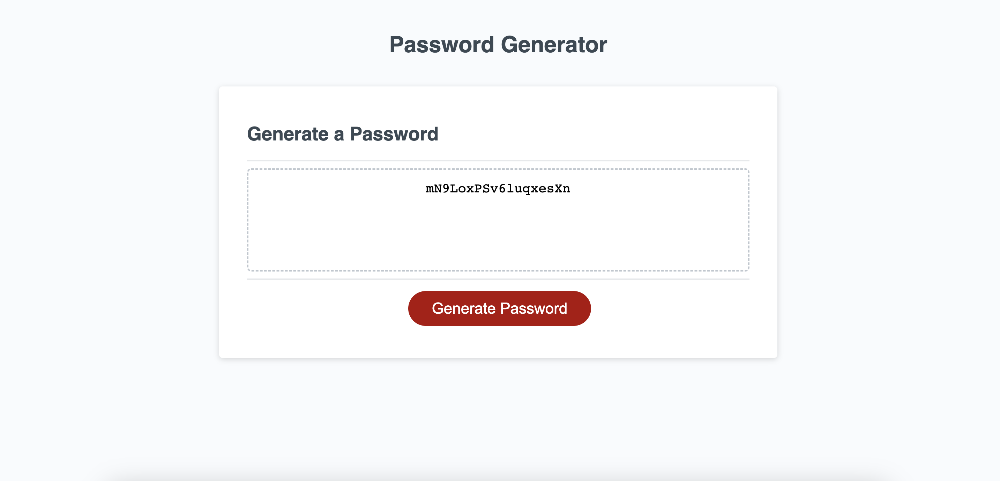

# 03 JavaScript: Jenny's Password Generator

## Description

My Challenge requires modifying starter code to create an application that enables employees to generate random passwords based on criteria that they’ve selected. This app will run in the browser and will feature dynamically updated HTML and CSS powered by JavaScript. It will have a clean and polished, responsive user interface that adapts to multiple screen sizes.

## Usage

To use this Password Generator, you can click on the Generate password button and follow the prompts. 

You can also click this link to the deployed site: https://jnaoroji.github.io/PasswordGeneratorJN/

## Screenshot

The following image shows my web application's appearance and functionality:

## Credits

* https://developer.mozilla.org
* see this [list of password special characters](https://www.owasp.org/index.php/Password_special_characters) from the OWASP Foundation.

## License

Please refer to the LICENSE in the repo.

